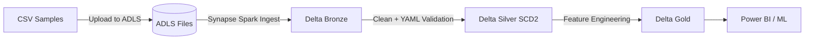

# Azure-Native Medallion Insurance Data Pipeline

**Batch-only Medallion Architecture for Insurance ML Workflows on Azure Synapse Analytics**

[](https://azure.microsoft.com)
[](https://azure.microsoft.com/services/synapse-analytics/)
[](https://www.python.org/)
[](https://delta.io/)

## 📋 Overview

Simplified Batch Medallion architecture for insurance ML workflows using **Azure-native services** (no Fabric, no Databricks):

- ✅ **Azure Synapse Analytics** - Spark Pools + Pipelines orchestration
- ✅ **ADLS Gen2** - Delta Lake storage with HNS enabled
- ✅ **Medallion Pattern** - Bronze (raw) → Silver (cleaned + SCD2) → Gold (features)
- ✅ **Schema Validation** - YAML-based contracts with inline enforcement
- ✅ **IaC (Bicep)** - Infrastructure as Code for reproducible deployments
- ✅ **GitHub Actions** - Automated deployment from push (first-time ready)
- ✅ **Zero Manual Setup** - Complete automation including data upload

## 🏗️ Architecture



## 📂 Project Structure

```
Azure-Native-Medallion-Insurance-Data-Pipeline/
├── infrastructure/                # Bicep IaC
│   ├── main.bicep                # Main orchestration
│   └── modules/
│       ├── storage.bicep         # ADLS Gen2 + containers
│       ├── keyvault.bicep        # Secrets management
│       ├── synapse.bicep         # Workspace + Spark Pools
│       └── roles.bicep           # RBAC assignments
│
├── synapse/
│   ├── notebooks/                # PySpark notebooks (.ipynb)
│   │   ├── bronze_ingest_*.ipynb
│   │   ├── silver_clean_*.ipynb
│   │   └── gold_create_*.ipynb
│   └── pipelines/
│       └── master_batch_pipeline.json
│
├── config/
│   └── schemas/                  # YAML schema contracts
│       ├── bronze/*.yaml
│       └── silver/*.yaml
│
├── data/
│   └── samples/
│       └── batch/*.csv           # Sample insurance data
│
├── .github/workflows/
│   └── deploy.yml                # Automated deployment
│
└── README.md
```

## 🚀 Quick Start

### Prerequisites

- Azure subscription
- GitHub repository
- Azure CLI installed (for local testing)

### Deployment (Fully Automated)

1. **Configure GitHub Secrets**:
   - `AZURE_CREDENTIALS` (Service Principal JSON)
   - `AZURE_SUBSCRIPTION_ID`

2. **Push to GitHub**:
   ```bash
   git push origin main
   ```

3. **GitHub Actions will**:
   - Deploy all Azure resources (Synapse, ADLS, Key Vault)
   - Upload sample data and schemas to ADLS
   - Import Synapse notebooks and pipelines
   - Create and start daily triggers

4. **Verify**:
   - Navigate to Azure Portal → Synapse Workspace
   - Run `master_batch_pipeline` manually (or wait for daily trigger)
   - Check Delta tables in ADLS: `bronze_*`, `silver_*`, `gold_*`

## 🔧 Key Components

| Component | Technology | Purpose |
|-----------|-----------|---------|
| **Compute** | Synapse Spark Pools | Distributed PySpark processing |
| **Storage** | ADLS Gen2 (HNS enabled) | Delta Lake tables + files |
| **Orchestration** | Synapse Pipelines | Batch workflow scheduling |
| **Secrets** | Azure Key Vault | Secure credential storage |
| **IaC** | Bicep | Reproducible infrastructure |
| **CI/CD** | GitHub Actions | Automated deployment |

## 📊 Data Flow

### Bronze Layer (Raw Ingestion)
- Read CSV with `inferSchema=false` (all columns as strings)
- Add metadata: `ingestion_timestamp`, `process_id`, `source_file_name`
- Write to Delta: `abfss://tables@<storage>.dfs.core.windows.net/bronze/bronze_*`

### Silver Layer (Cleaned + SCD2)
- Read Bronze Delta tables
- Apply YAML schema transformations (type casting, validation)
- Add SCD Type 2 columns: `effective_from`, `effective_to`, `is_current`
- Write to Delta: `abfss://tables@<storage>.dfs.core.windows.net/silver/silver_*`

### Gold Layer (ML Features)
- Aggregate features by customer/policy
- Time-series analysis (monthly claims summary)
- Write to Delta: `abfss://tables@<storage>.dfs.core.windows.net/gold/gold_*`

## 🔐 Security

- **Managed Identity**: Synapse Workspace MI accesses ADLS/Key Vault
- **RBAC**: Least-privilege role assignments
- **Secrets**: All credentials stored in Key Vault
- **Network**: (Optional) Private endpoints for production

## 📝 Configuration

### Infrastructure Parameters

Edit `infrastructure/main.bicep` parameters:
- `baseName`: Resource naming prefix (default: `insurance-ml`)
- `location`: Azure region (default: resource group location)
- `sparkPoolSize`: Small/Medium/Large (default: `Small`)
- `sparkPoolAutoScale`: Enable/disable auto-scaling (default: `true`)

### Deployment Scripts

The `scripts/` directory contains utility scripts for deployment:

#### `update_notebook_config.py`

Automatically updates storage account placeholders in all Synapse notebooks. This script is executed automatically during GitHub Actions deployment.

**Manual Usage** (if needed):
```bash
# Get storage account name from deployment
STORAGE_ACCOUNT=$(az deployment group show \
  --resource-group rg-insurance-ml-pipeline \
  --name main-12345 \
  --query "properties.outputs.storageAccountName.value" -o tsv)

# Update all notebooks
python scripts/update_notebook_config.py $STORAGE_ACCOUNT
```

**Note:** This script runs automatically in the CI/CD pipeline before importing notebooks to Synapse.

## 🧪 Testing

Run notebooks individually in Synapse Studio:
1. Bronze: `bronze_ingest_claims.ipynb`
2. Silver: `silver_clean_claims.ipynb`
3. Gold: `gold_create_claims_features.ipynb`

Or trigger full pipeline:
```bash
az synapse pipeline run \
  --workspace-name <synapse-workspace> \
  --name master_batch_pipeline
```

## 📖 License

MIT License - see LICENSE file

## 🔍 Code Quality & Audit

### Production Readiness Checklist

✅ **Dead Code Analysis**: No unused files or functions detected

✅ **Notebook Logic**: All PySpark notebooks validated for correctness
- Fixed risk score calculation in `gold_create_risk_features.ipynb` (column reference error)
- Removed redundant aggregation in `gold_create_monthly_claims_summary.ipynb`
- Added column validation to all silver layer notebooks

✅ **Schema Validation**: All schemas aligned with source data
- Bronze claims schema: Added `customer_id` as required column
- Silver claims schema: Moved `customer_id` to business_columns
- Silver customers schema: Made `age` nullable to match data reality

✅ **File Integration**: All dependencies properly configured
- Bronze → Silver: One-to-one mapping with deduplication
- Silver → Gold: Multi-source joins with proper null handling
- Pipeline orchestration: Correct dependency chain with proper sequencing

✅ **Deployment Workflow**: GitHub Actions pipeline validated
- Added file existence check for trigger configuration
- Improved error handling in deployment steps
- All Azure CLI commands use correct syntax

✅ **Resource Naming**: Standardized naming convention
- Storage Account: `{baseName}st{env}{suffix}` (alphanumeric, ≤24 chars)
- Synapse Workspace: `{baseName}-syn-{env}-{suffix}`
- Key Vault: `{baseName}kv{env}{suffix}` (alphanumeric, ≤24 chars)
- Spark Pool: `{baseName}-spark-{env}`

### Fixes Applied

| File | Issue | Fix |
|------|-------|-----|
| `gold_create_risk_features.ipynb` | Column reference error after drop | Reordered calculations to compute before drop |
| `gold_create_monthly_claims_summary.ipynb` | Redundant count aggregation | Removed duplicate `claim_count` column |
| `bronze_claims.yaml` | Missing `customer_id` in schema | Added as required non-nullable column |
| `silver_claims.yaml` | `customer_id` in wrong section | Moved to business_columns |
| `silver_customers.yaml` | Age marked non-nullable | Changed to nullable |
| `silver_*.ipynb` (all 4) | No column validation | Added existence check before transformation |
| `deploy.yml` | Unsafe trigger file reference | Added file existence validation |
| `main.bicep` | Inconsistent naming patterns | Standardized all resource names |

## 🙏 Acknowledgments

Based on Medallion architecture best practices and Azure-native design patterns.
